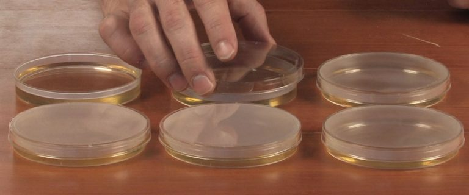

```{r setup, include=FALSE}
library(learnr)
library(mosaic)
knitr::opts_chunk$set(echo = FALSE)
```


## Multiple explanatory variables

### Introduction
You will often collect data where you have more than one explanatory variable,
and there are two particular areas where this might arise:

* Designed experiments
* Surveys or 'natural' experiments

**Designed experiments** are typically laboratory studies where you have
considerable control over the structure of the study, the number of replicates,
the different treatment(s) used etc. Designed experiments can also be plot-
based agricultural experiments, or animal behaviour experiments. In contrast,
**natural experiments** may arise where you want to study species distributions,
ecological characteristics or wildlife patterns in as natural and un-modified
situation as possible. This of course results in you having less ability to
decide what variables to include, because there may be numerous factors in the
environment that are affecting the species you are studying.

## The value of randomisation
The simplest type of experimental design includes some sort of randomisation, and
can be used in both laboratory- and field-experiments. Randomisation is useful for
both 'designed' and 'natural' experiments. The need for multiple replicates may
seem fairly obvious to you, but think about one of the world's oldest agricultural
experiments, the Palace Leas Experiment at Cockle Park, which many of you will have
visited:


Thos of you who have visited the site will know that it slopes gently down a
hill away from the farm lane, down towards a stream, with a series of 14 
roughly rectangular shaped plots receiving different treatments:


Some treatments are replicated (for different years in the rotation cycle
for treatments) but not all of them are replicated. In fact, standard theories on
good practice for experimental design had not been developed when the Palace Leas
experiment was started. Since the start of the experiment, changes to sampling
methods have eased some problems, by dividing each long rectangle into 4 sub-units
for sampling, but there remain some problems, and advanced statistical methods
are sometimes needed.


```{r palace_leas, echo=FALSE}
question("What do you think are some of the challenges that arise from the original
         design? (select ALL that apply)",
  answer("There may be an effect from being near the road", correct = TRUE),
  answer("There is no replication"),
  answer("Plots near the stream may be wetter", correct = TRUE),
  answer("There is the risk of manure or slurry run-off from the road", correct = TRUE),
  answer("Multiple samples cannot be taken within a plot"),
  answer("Samples within a plot might not be independent", correct =TRUE)
)
```

## Ways to randomise your treatments
### Fully randomised design
There are several methods of creating multiple replicates of your experimental 
units and randomising the allocation of treatments to them. To give you some
examples:

1. You might want to investigate the effect of a new antibiotic on bacterial growth.


     
   + Your **experimental units** could be Petri-dishes on which you grow bacteria.
   + Your **response variable** is bacterial growth
   + Your **explanatory variable** has is a categorical 'factor': no antibiotic, your new antibiotic

2. You are interested in the effects of _Rhinanthus minor_ on species diversity
in grasslands. _Rhinanthus_ is a parasite of grasses, and therefore reduces their
vigour. This allows other species of wildflower to colonise the grassland.

     + Your **experimental units** could be different plots in a meadow, each 10 x 10 m
     + Your **response variable** is the overall diversity of wildflowers
     + Your **explanatory variable** is a factor with two categories: a control, and plots with
_Rhinanthus_ seed growing

You can probably think of other studies where you have explanatory variables with
3, 4 or more categorical levels in them.

You decide to create a simple fully randomised design experiment, with 5 replicates
for each of your two treatments. So for the antibiotic experiment, you have 5 Petri
dishes without antibiotic (control), and 5 with your new antibiotic, and you put
these onto a plastic tray in the incubator.  For the _Rhinanthus_ experiment you
have 5 plots in your field without any _Rhinanthus_ seed added (control), and 5
with the seed. You toss a coin to allocate treatments to Petri dishes or plots,
and end up with the following design.


```{r fully_randomised, echo=FALSE}
question("What do you think is the problem with this design; A is your control
         (no antibiotic, or no Rhinanthus) and B treatment (antibiotic or 
         Rhinanthus)",
  answer("There are not enough replicates", message = "Although replication is
         low, it might be sufficient, especially if you have done pilot studies"),
  answer("There are only two treatment levels in the explanatory variable. You 
         need at least three, e.g. different concentrations of antibiotic, or
         different seed sowing rates", message = "Only 2 levels in your explanatory
         variable is sufficient"),
  answer("Most of the control Petri-dishes or plots are at one end of the tray
         or field respectively", correct = TRUE, message = "Good. This may bias
         your results"),
  allow_retry = TRUE
  )
```

Think back to the Palace Leas experiment, which was on a slope. Even if it had
originally been created as a fully randomised experiment, it would not be ideal
if most of the plots for one of the fertiliser treatments plots had ended up,
purely by chance, by the road or by the stream. Likewise, temperatures in an
incubator are less stable near the door than at the back of an incubator. If most
of your Petri-dishes for the antibiotic were, purely by chance, near the door
then that might bias your results.

Of course you could eventually get round this problem by greatly increasing the
number of replicates. But that would be expensive and time-consuming. Instead
you can slightly change how you set up your experiment, so that it is more robust,
yet use no more resources.