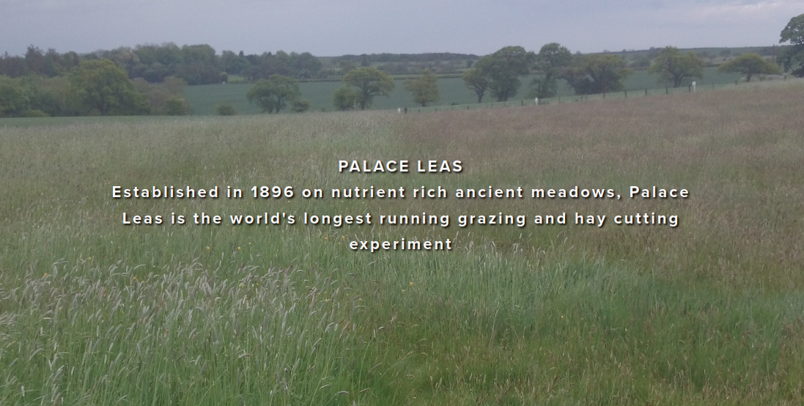

```{r setup, include=FALSE}
library(learnr)
library(mosaic)
knitr::opts_chunk$set(echo = FALSE)
```


## Multiple explanatory variables

### Introduction
You will often collect data where you have more than one explanatory variable,
and there are two particular areas where this might arise:

* Designed experiments
* Surveys or 'natural' experiments

**Designed experiments** are typically laboratory studies where you have
considerable control over the structure of the study, the number of replicates,
the different treatment(s) used etc. Designed experiments can also be plot-
based agricultural experiments, or animal behaviour experiments. In contrast,
**natural experiments** may arise where you want to study species distributions,
ecological characteristics or wildlife patterns in as natural and un-modified
situation as possible. This of course results in you having less ability to
decide what variables to include, because there may be numerous factors in the
environment that are affecting the species you are studying.

## The value of randomisation
The simplest type of experimental design includes some sort of randomisation, and
can be used in both laboratory- and field-experiments. Randomisation is useful for
both 'designed' and 'natural' experiments. The need for multiple replicates may
seem fairly obvious to you, but think about one of the world's oldest agricultural
experiments, the Palace Leas Experiment at Cockle Park, which many of you will have
visited:



Thos of you who have visited the site will know that it slopes gently down a
hill away from the farm lane, down towards a stream, with a series of 14 
roughly rectangular shaped plots receiving different treatments:


Some treatments are replicated (for different years in the rotation cycle
for treatments) but not all of them are replicated. In fact, standard theories on
good practice for experimental design had not been developed when the Palace Leas
experiment was started. Since the start of the experiment, changes to sampling
methods have eased some problems, by dividing each long rectangle into 4 sub-units
for sampling, but there remain some problems, and advanced statistical methods
are sometimes needed.


```{r palace_leas, echo=FALSE}
question("What do you think are some of the challenges that arise from the original
         design? (select ALL that apply)",
  answer("There may be an effect from being near the road", correct = TRUE),
  answer("There is no replication"),
  answer("Plots near the stream may be wetter", correct = TRUE),
  answer("There is the risk of manure or slurry run-off from the road", correct = TRUE),
  answer("Multiple samples cannot be taken within a plot"),
  answer("Samples within a plot might not be independent", correct =TRUE)
)
```

